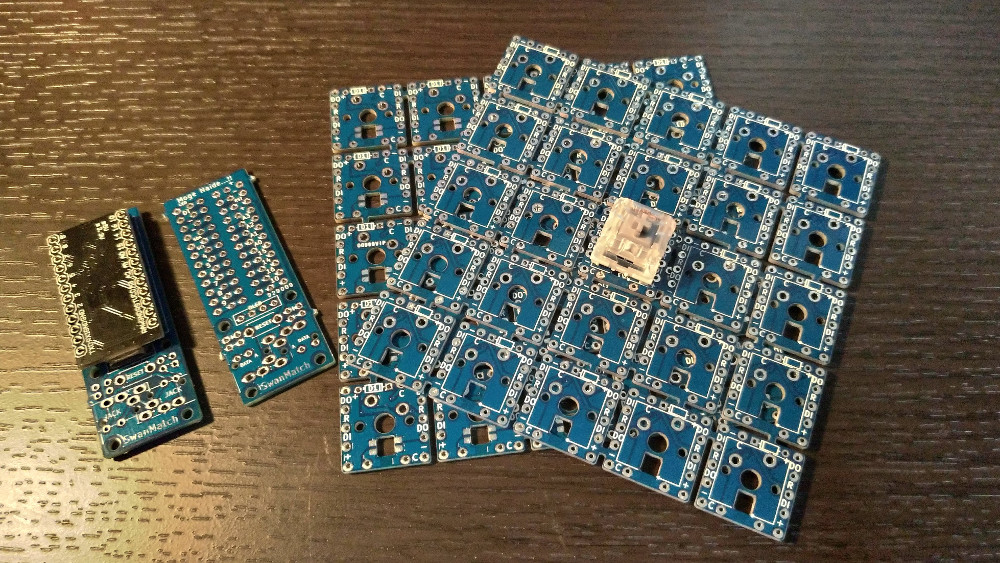
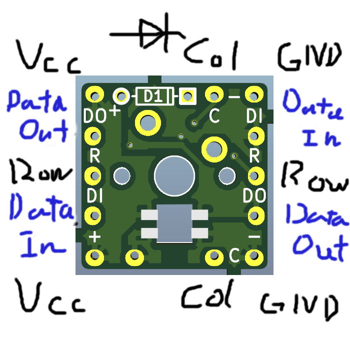
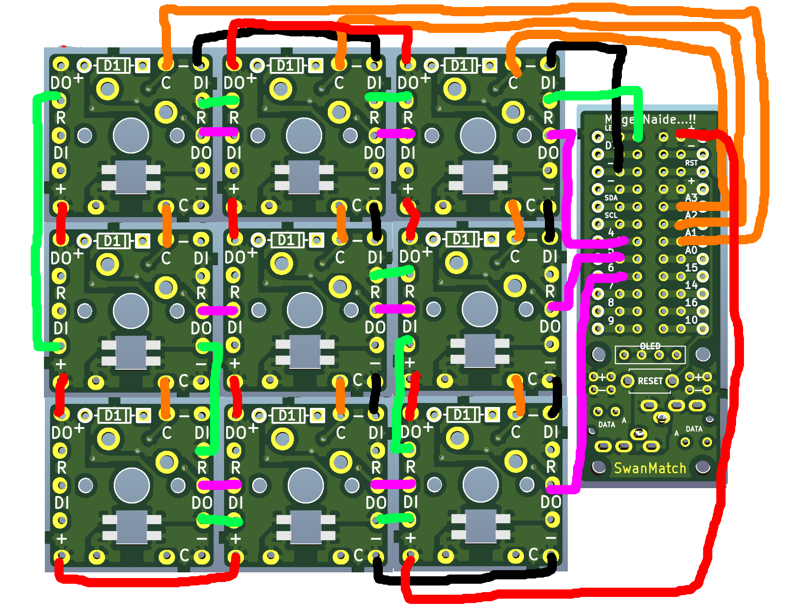

# 無限の可能性

[Cherry-Mx-Bitboard](https://github.com/ogatatsu/Cherry-Mx-Bitboard)を改変し、
helixを参考にSK6812miniがハマるようにしたものです。

自作キーボード用のプリント基板、１つの基板が１個のスイッチに対応しています。

この基板を使うと、基板設計をしなくてもオリジナル配列のフルカラーバックライトのキーボードが作れます。

たとえば…！

詳しくは[こちら](https://swan-match.hatenablog.com/entry/2018/09/15/184923)。

[トッププレートの作り方](https://swanmatch.github.io/topplate_tips)を公開しました。

[English](https://translate.google.com/translate?hl=ja&sl=auto&tl=en&u=https%3A%2F%2Fswanmatch.github.io%2FMxLEDBitPCB%2F&sandbox=1)

## 無限の可能性シリーズ

### ProMicroのおうち

ProMicroのPinを取り出せるようにし、
OLED、リセットスイッチ、分割キーボード向けのTRRS、
そしてマウント用のM2ネジ穴を足したもの。  
TRRSのPinアサインはHelix互換。

### 無限の可能性シリーズ

無限の可能性には複数のシリーズがあり、それぞれ対応するLED,スイッチダイオードが違います。  
以下に仕様をまとめます。

プロジェクト | スイッチ | Kailhソケット利用可否 | LED | スルーホールダイオード | SOD-123 |
-|-|-|-|-|-
Nexus | MX | No | SK6812MINI | Yes | No |
Altana | MX | Yes | SK6812MINI | Yes | No |
Suxen | MX | No | YS-SK6812MINI | Yes | Yes(*) |
Container | MX | Yes | YS-SK6812MINI | Yes | Yes(*) |
Choc | KailhLowProfile | No | YS-SK6812MINI | No | Yes |

(*) スウェンとコンテナでSOD-123を使う場合、スペースの都合で片方のパッドをスルーホールの穴と共有することになるので、少しトリッキーな実装になります。

## 材料例(仕入先)

* 任意にカットしたプレート
  * 2mmアクリル板(遊舎工房さん)  
    3mmアクリル角材とアクリルサンデーなどの接着剤があるとよいです。(ホームセンター)
  * 3Dケース(DMM.make)
  * 5mmダンボール(そのへんから拾ってくるなど。)
* スイッチングダイオード1N4148、SOD-123(TALPKeyboardさん)
* SK6812mini、YS-SK6812MINI-E(遊舎工房さん)
* Kailhソケット(遊舎工房さん、Talpkeyboardさん、Kbdfansさん)
* ウレタンエナメル線(0.35～0.45mmくらいのものがオススメ。ホームセンタなどにもある。ビニル線でも可能ですが溶けちゃったり結構大変)
* TRRSジャック、RESETボタン(秋月電子さん)
* OLED(オプション、遊舎工房さん)
* Promicro(遊舎工房さん、TALPkeyboardさん)
* 各種スペーサー、ネジ(廣杉計器さん、Wilcoさんなど)
* キースイッチ、キーキャップ(お好みに応じて遊舎工房さん、TalpKeyboardさんなど)
* USBケーブル、TRS(3.5mm3極)ケーブル

その他に温度調節はんだごて、テスター、ピンセットなどの工具が必要です。

## Pinアサイン

無限の可能性のピン配置は以下の通りです。

* Ｃ: 横線(Col)
* Ｒ: 縦線(Row)
* DI: LED制御信号入力(DataIn)
* DO: LED制御信号出力(DataOut)
* －: グランド(LED用)
* ＋: VCC(LED用5V)

## 組立手順

1. SK6812miniをはんだ付けします。  
  温度調節はんだごてで220℃くらいではんだ付けしてください。  
  もたもたしていると壊れます。  
  はんだも融点200℃以下の低温はんだを使ってください。
2. ダイオードをはんだ付けします。
3. トッププレートにスイッチをはめて、裏に無限の可能性をはめてスイッチの足をはんだ付けします。  
  (アルタナはソケット)
  このとき2mmアクリル板を使う場合は、スイッチが抜けてしまうのを防ぐため、
  プレート裏面のスイッチ脇に3mmアクリル角材をアクリル接着剤などでくっつけておくこといいです。
4. 自身の組みたいキーボードのキーマトリックスに合わせ、横線(Col)と縦線(Row)を配線します。
5. 全ての「－」と「＋」をつなげる。
6. LEDの光らせたい順番にDIからDOに数珠つなぎに配線していきます。
  一個目DO→二個目DI→二個目DO→三個目DI…
7. TRRSJACKとRESETスイッチをはんだ付けします。
8. OLEDソケットをはんだ付けします。
9. 任意のピンの横の穴からColとRow、LED(DO)、GND、VCCをそれぞれ無限の可能性に対して配線します。
10. Promicroをソケットにはんだ付けします。  
  (コンスルーを使ってもいいですが、もげたらソケットごと交換したほうが安上がり。)
11. お好みに合わせてファームウェアを作成して書き込んで完成。  
  ファームウェアは[QMK_Firmware](https://github.com/qmk/qmk_firmware)を使うととても簡単です。  
  参考: [自作キーボードのファームウェアを用意する手段3種類](https://skyhigh-works.hatenablog.com/entry/2018/10/09/120909)

## 配線例

例えば3*3の格子配列だったら以下のような配線になります。  
(ネクサス・アルタナで、切り離さなかった場合は、基板間のCol,Row,縦のVCCとGNDの配線が不要です。)  
ウレタンエナメル線(UEW)は被膜を剥がすのが結構大変なので、
ショートの可能性が少ない隣り合う基板間の配線は、
切り落としたダイオードの足などでもいいかもです。  
LEDは右上から螺旋状に配線しています。

### 注意事項

* 2019/4月より流通している、ネクサス・アルタナはCol、Row、縦の電源ライン(VCC,GND)が配線済みです。
* アルタナはKailhのソケットを使ってスイッチを交換できるバージョンです。
* もしも万が一やんごとなき事情で、どうしてもLEDを光らせる必要がない場合、
  ColとRowだけ配線すればキーボードとして機能します。
* 国内でよく採用されている、サンドイッチマウントのキーボードの場合、
  トッププレートとボトムプレートをスペーサーで配置しますが、
  無限の可能性の場合キーの間にスペーサーが入る隙間がありません。
  キーの外側にネジ穴を設けてください。
* 「おうち」は、先にPromicroをはんだ付けしてしまうと、
  無限の可能性側と配線する際に、ハンダがホールからもれて、
  Promicro本体の部品をショートさせてしまう場合があります。  
  Promicroは最後にはんだ付けするようにしてください。

## 終わりに

この基板を使ってキーボードを組んだ際にはぜひ[@swan_match](https://twitter.com/swan_match)までご一報ください。

あなたのEndGameを応援しています！！

## Licence

https://creativecommons.org/licenses/by/4.0/

